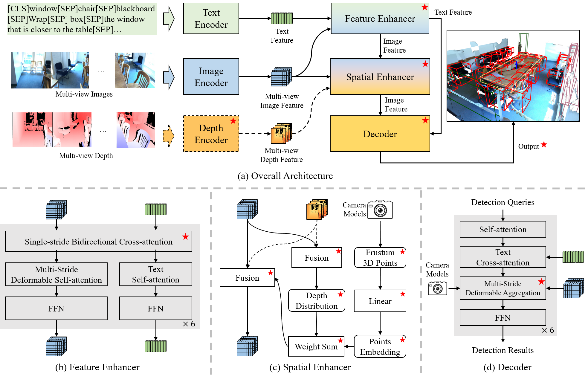

# BIP3D: Bridging 2D Images and 3D Perception for Embodied Intelligence

> [Arxiv](https://arxiv.org/abs/2411.14869)

## Overall Architecture

    
     
    
The Architecture Diagram of BIP3D, where the red stars indicate the parts that have been modified or added compared to the base model, GroundingDINO, and dashed lines indicate optional elements.

